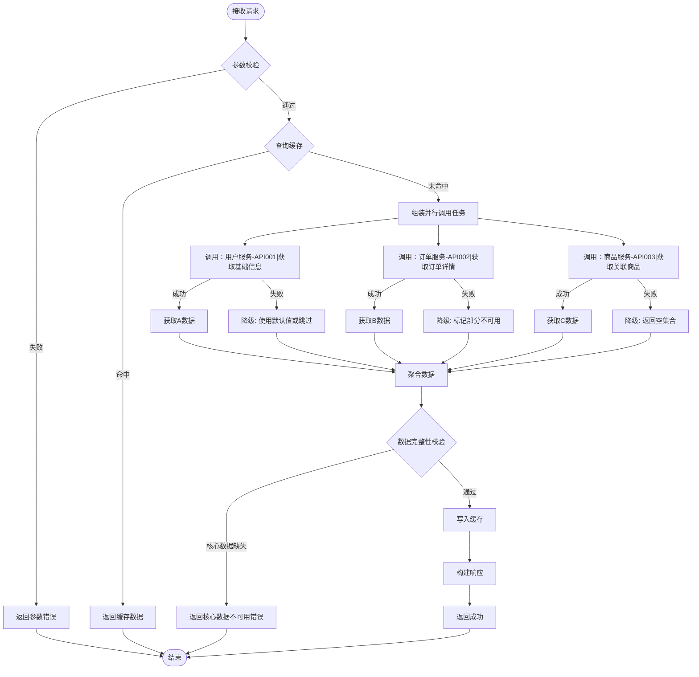

# 聚合类 API 模板

聚合类接口（编排多个服务/接口的 API）需体现：并行调用策略、结果聚合、部分失败降级、超时兜底。

## 要点说明

| 要点 | 模板体现位置 |
|------|------------|
| 并行调用 | `BuildTasks` 分支到多个 `NodeID["调用：服务名-API编号|API名称"]` |
| 降级策略 | 每个调用都有 `失败→Fallback` 分支 |
| 核心/非核心区分 | `ComposeCheck` 校验核心数据是否缺失 |
| 缓存策略 | `CacheCheck` → 命中返回 / `CacheWrite` → 聚合后写入 |
| 超时兜底 | 每个调用节点标注超时时间（如 `timeout: 3s`） |
