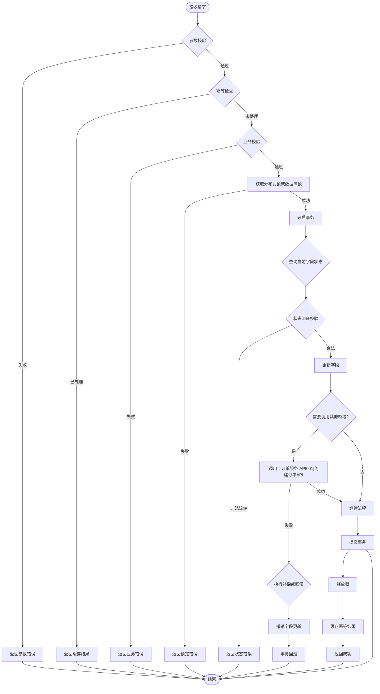

# 操作类 API 模板

操作类接口(创建/更新/删除)需体现：字段生命周期、事务边界、幂等保障、跨服务调用补偿。

## 节点 ID 规范

模板中的节点 ID（如 `Validate`、`BizCheck`）仅为示例占位符，**实际使用时必须替换为业务相关的唯一 ID**，且同一 ID 不得重复定义。

## 模板

## 要点说明

| 要点 | 模板体现位置 |
|------|------------|
| 字段生命周期 | `QueryField`(来源) → `StatusCheck`(处理) → `FieldOp`(去向) |
| 事务边界 | `TxBegin` → `TxCommit` / `TxRollback`，避免大事务 |
| 幂等保障 | `IdempotentCheck` → 缓存结果 + `AcquireLock` 分布式锁 |
| 跨服务补偿 | `Compensate` → `RollbackField` → `TxRollback` |
| 领域间调用 | `NodeID["调用：服务名-API编号|API名称"]` 标准格式 |
| 批量IO | `FieldOp` 为批量操作节点，禁止循环内逐条IO |
