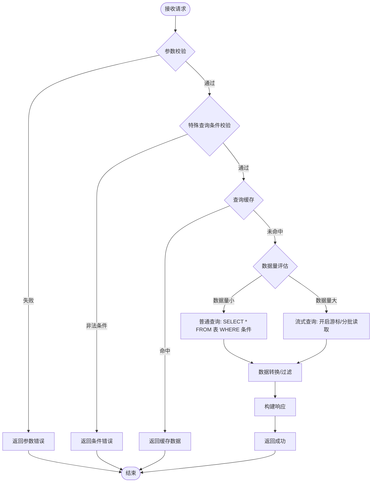

# 查询类 API 模板

查询类接口需体现：缓存策略、特殊查询条件、流式查询。

## 要点说明

| 要点 | 模板体现位置 |
|------|------------|
| 特殊查询条件 | `QueryCondCheck`(如固定查询条件、权限过滤) |
| 缓存策略 | `CacheCheck` → 命中直接返回 |
| 流式查询 | `DataSizeCheck` → `StreamQuery`(大数据量场景) |
| 字段明确 | 有过滤/排序/关联查询时需注明涉及的表 |
| 批量IO | `StreamQuery` 为流式批量读取，禁止逐条查询节点 |
