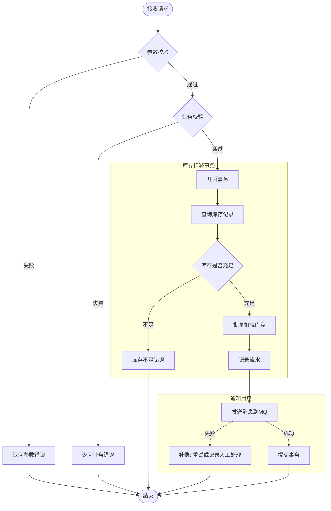

# 子图(subgraph)示例

当单个 API 逻辑较复杂时，用子图将相关操作分组，提高可读性。

```mermaid
flowchart TD
    Start([接收请求]) --> Validate{参数校验}
    Validate -->|失败| ParamError[返回参数错误]
    Validate -->|通过| BizCheck{业务校验}
    BizCheck -->|失败| BizError[返回业务错误]

    %% 用子图组织事务内操作
    BizCheck -->|通过| TxBegin[开启事务]

    subgraph 库存扣减事务
        TxBegin --> QueryStock[查询库存记录]
        QueryStock --> StockCheck{库存是否充足}
        StockCheck -->|不足| StockError[库存不足错误]
        StockCheck -->|充足| DeductStock[批量扣减库存]
        DeductStock --> RecordLog[记录流水]
    end

    %% 用子图组织外部调用
    subgraph 通知用户
        RecordLog --> SendMQ[发送消息到MQ]
        SendMQ -->|失败| MQCompensate[补偿: 重试或记录人工处理]
        SendMQ -->|成功| TxCommit[提交事务]
    end

    %% 异常统一结束
    ParamError --> End([结束])
    BizError --> End
    StockError --> End
    MQCompensate --> End
    TxCommit --> End
```

使用规范见 [api-rules.md](api-rules.md#子图subgraph使用规范)。
